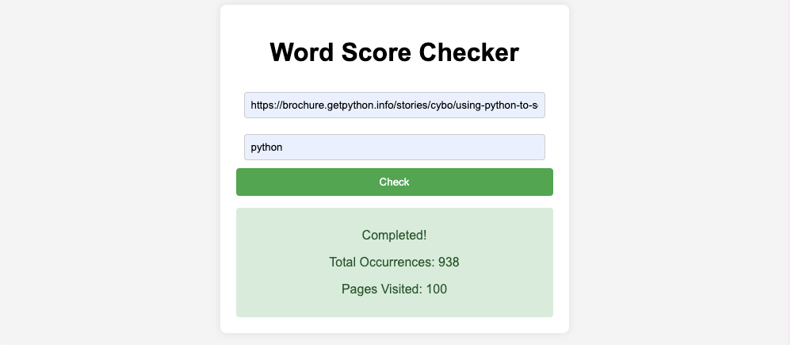

# Word Score Web App

## 📌 Project Overview
This project is a Django-based web application that allows users to analyze the occurrence of a specific word across multiple pages starting from a given URL. The application utilizes Celery and Redis for asynchronous processing to prevent long response times.

This README provides an overview of how to handle real-world challenges, explains why the application is I/O bound, and outlines strategies for scaling the application in a distributed environment.

Here's a screenshot of the app:



## ⚙️ Tech Stack
- **Backend:** Django, Celery
- **Frontend:** HTML, CSS, JavaScript
- **Database:** SQLite (Not used at this stage)

## Requirements

- [uv](https://docs.astral.sh/uv): A tool used to manage the environment for this project.
- [redis](https://redis.io/): An open source, in-memory, NoSQL key/value store.

## 🚀 Setup & Installation

### 1️⃣ Clone the Repository

  ```bash
  git clone https://github.com/Zughayyar/Word-Score-App-Django.git
  ```

### 2️⃣ Navigate to the django project directory

  ```bash
    cd Word-Score-App-Django/_word_score   
  ```

### 3️⃣ Run migrate 
  ```sh
  uv run manage.py migrate
  ```

### 4️⃣ Run django project (Ensure Redis is Running)
  ```sh
  uv run manage.py runserver
  ```
If Redis is not running:
  ```sh
  sudo systemctl start redis  # Linux
  brew services start redis   # macOS
  ```

### 5️⃣ Start Celery Worker 
  ```sh
  uv run celery -A _word_score worker --loglevel=info
  ```

---

## 📌 How It Works
1. **User Inputs** a URL and a word.
2. The application **fetches** all linked pages up to a certain depth.
3. It **counts** the word occurrences asynchronously using Celery.
4. Users are redirected to the homepage to view the results.


## Real World Challenges and Constraints

When developing the **Word Score App**, several real-world challenges need to be considered:

1. **Link Depth (Navigating Links):**
   - When collecting URLs or processing linked content, it’s important to determine how deep you should navigate to find additional links. Going too deep can significantly increase processing time and complexity. A balance should be struck between depth and performance, possibly introducing configurable depth limits for users to set.

2. **Error Handling - Invalid URLs:**
   - If a URL doesn't exist or returns a 404 error, the application should gracefully handle the situation by logging the error and either skipping the URL or retrying with a different approach. It's essential to provide clear feedback to users if URLs are invalid or unreachable.

3. **Error Handling - Network Issues:**
   - If a network issue occurs, such as a timeout or connectivity problem, the application should implement retry logic. This ensures that intermittent issues don't disrupt the entire process. Consider adding a retry limit or exponential backoff for retries to prevent overloading the system.

4. **Error Handling - HTML Syntax Errors:**
   - If the HTML page being processed contains syntax errors, the application should have a robust error handling mechanism in place. This could involve skipping the page, logging the issue for review, or attempting to recover by parsing the content more leniently. It’s important to ensure that errors in the HTML structure do not cause the entire process to fail.

By anticipating and addressing these challenges, the **Word Score App** can handle a wide variety of real-world scenarios while maintaining stability and performance.

## CPU Bound Analysis

The app is primarily **I/O bound**, not CPU bound. Here's why:
- The majority of time is spent on I/O operations like downloading pages, reading from disk, and network communication, which are slower than CPU operations.
- CPU usage is focused on string operations for word counting, which are relatively quick compared to I/O tasks.
- Although using `ThreadPoolExecutor` helps utilize CPU time more efficiently by parallelizing operations, the bottleneck remains I/O.

## Scaling Over Multiple Servers/Containers

- **Load Balancer:** Use tools like Nginx, HAProxy, or cloud services (AWS ELB, Google Cloud Load Balancing) to distribute tasks. Consider message queues (e.g., RabbitMQ, Apache Kafka) for task distribution.

- **Database for Storing URLs and Occurrences:** Use databases (PostgreSQL, MySQL, Redis) to track processed URLs and store results for resuming operations. Suggested schema: `url`, `word`, `occurrences`, and `processed`.

- **Microservices Architecture:**
  - Separate tasks into services: URL Collector, Page Downloader, Word Counter, and Result Aggregator.
  - **Benefits:** Scalability, maintainability, and resilience. Use REST APIs, gRPC, or message queues for communication.

This overview outlines strategies for scaling the app in a distributed environment.


## 📞 Contact
- **Author:** Anas Zughayyar  
- **Email:** anas.ezzughayyar@gmail.com  
- **LinkedIn:** [linkedin.com/in/anasez](https://www.linkedin.com/in/anasez)

